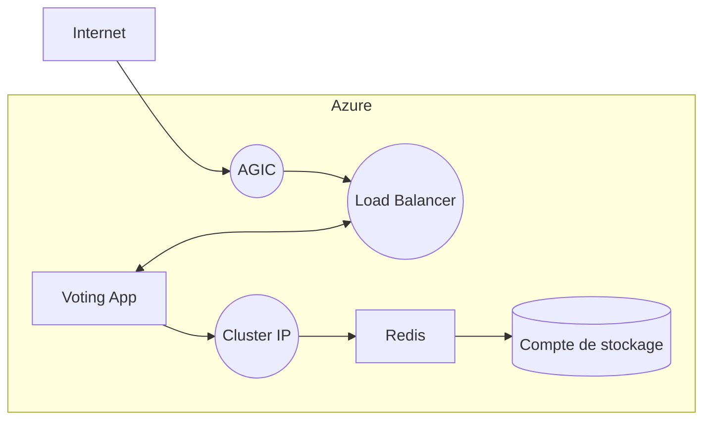

# Simplon - Brief 6

## Schéma de l'infrastructure finale


## Déploiement
### Infrastructure minimale
#### 1. Création d'un groupe de ressource

```
$ az group create --name myResourceGroup --location eastus
```

#### 2. Création d'un cluster AKS (avec le plugin AGIC)
```
$ az aks create -n myCluster -g myResourceGroup --network-plugin azure --enable-managed-identity -a ingress-appgw --appgw-name myApplicationGateway --appgw-subnet-cidr "10.225.0.0/16" --generate-ssh-keys
```

#### 2. Déploiement de l'infrastructure

```
$ az aks get-credentials -n myCluster -g myResourceGroup
$ kubectl create secret generic redis-credentials --from-literal=username=mydbusername --from-literal=password=myinsanepassword
$ kubectl apply -f infrastructure.yml
```

### Nom de domaine + TLS
#### 1. Création de l'Ingress
>Ne pas oublier de remplacer `mydomain.com` par votre nom de domaine.
```
$ kubectl apply -f ingress-tls.yml
```

#### 2. Mise à jour de la partie DNS
Une fois sur le dashboard du fournisseur de nom de domaine, ajouter une règle `A` dans la zone DNS. <br />
Indiquez l'adresse IP publique de l'AGIC lors de la création de cette règle, obtenable grâce à la commande suivante :
```
$ kubectl get ingress
NAME                      CLASS    HOSTS         ADDRESS          PORTS     AGE
simple-frontend-ingress   <none>   mydomain.com  xx.xx.xx.xx      80, 443   5m
```

#### 3. Installation de cert-manager (v.1.8.0)
```
$ kubectl apply -f https://github.com/jetstack/cert-manager/releases/download/v1.8.0/cert-manager.yaml
```

#### 4. Gestion du certificat TLS
> Ne pas oublier de remplacer `my@email.com` par l'email communiquée à votre fournisseur de nom de domaine.
```
$ kubectl apply -f certificate-issuer.yml
```

#### 5. Vérification
Exécutez la commande suivante afin d'obtenir l'état du certificat :
`$ kubectl get certificate`

Si la valeur "READY" est égale à "True", alors le certificate est fonctionnel.

## Annexes
### Commandes d'administration
Permet d'obtenir l'adresse IP publique de l'Application Gateway : `$ kubectl get ingress`

Permet d'obtenir l'état du certificat (doit être sur Ready=True) : `$ kubectl get certificate`

### Sources
Redirection HTTP -> HTTPS : https://learn.microsoft.com/fr-fr/azure/application-gateway/redirect-http-to-https-portal#add-a-routing-rule-with-a-redirection-configuration
Aide pour l'activation du TLS : https://faun.pub/securing-your-aks-application-with-https-using-azure-application-gateway-lets-encrypt-7d6589b6e22a
