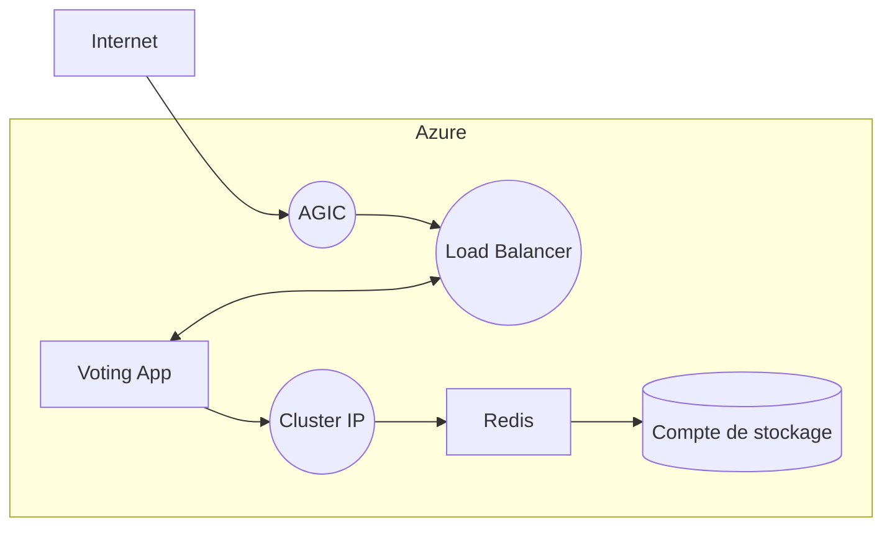

# simplon-brief-6-p2

```
az group create --name myResourceGroup --location eastus

az aks create -n myCluster -g myResourceGroup --network-plugin azure --enable-managed-identity -a ingress-appgw --appgw-name myApplicationGateway --appgw-subnet-cidr "10.225.0.0/16" --generate-ssh-keys

az aks get-credentials -n myCluster -g myResourceGroup

kubectl create secret generic redis-credentials --from-literal=username=mydbusername --from-literal=password=myinsanepassword

kubectl apply -f infra.yml
```

