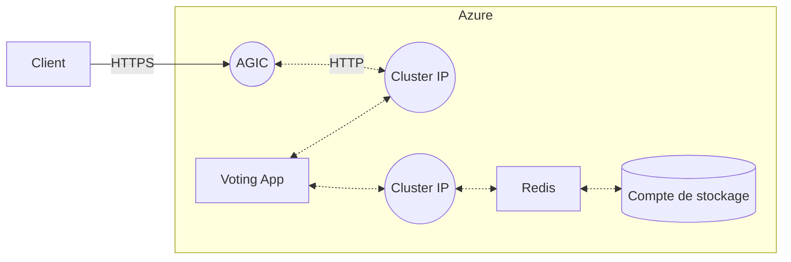

# Simplon - Brief 6

## Executive Summary
### Demande du client
Les utilisateurs doivent pouvoir voter sur une application web, elle doit être hautement disponible et accessible depuis un nom de domaine via le protocole `HTTPS`. Ses données doivent être persistantes.

### Solution proposée
Cette application sera déployée avec Kubernetes sur Azure. Un Ingress sera mis en place afin de pouvoir correspondre aux critères de sécurité cités plus haut. La base de données Redis, et la Voting App d'Azure seront choisies.

### État actuel
L'application fonctionne et est hautement disponible, ses données sont persistantes, et elle est accessible grâce à un nom de domaine via le protocole `HTTPS`.

## Fonctionnement de Kubernetes (aka k8s)

**Kubernetes** est un orchestrateur de conteneur, open-souce, développé par Google, basé sur **Docker**, permettant de déployer une infrastructure à l'aide de fichiers de configuration. 

Cet outil a pour particularité de modifier l'infrastructure existante afin de la faire correspondre avec la configuration donnée. Cela a pour avantage de ne pas avoir à supprimer puis recréer des ressources déjà fonctionnelles.

### Kubectl
`kubectl` est un outil en ligne de commande (CLI) permettant la communication avec l'API de Kubernetes.

Il permet d'appliquer des manifestes, de lire les logs, ou de connaitre le status des ressources déployées.

### Manifeste
Les fichiers de configuration (manifestes) doivent être écrits en YAML afin d'être interpretables.

Les ressources déployées via un manifeste k8s s'organisent en général de cette manière en YAML :

```yml
---
apiVersion: # Version de l'API chargée d'interpreter cette ressource
kind: # Type de ressource
metadata: # Métadonnées et labels
spec: # Paramètres de la ressource
```

### Secrets
A l'aide de `kubectl`, il est possible de créer des secrets. Cette fonctionnalité permet de garder privé, des token, ou des identifiants que l'on souhaiterai utiliser dans un manifeste.

### Ressources
#### Deployment et pods
Un `Pod` est une surcouche regroupant un ou plusieurs container. Un `Deployment` permet la configuration et le déploiement d'un ou plusieurs pods (voir [documentation officielle](https://kubernetes.io/docs/concepts/workloads/controllers/deployment/) pour des exemples).

#### Réseau
Deux types de `Service` sont utilisés dans ce brief, le `ClusterIP` et le `LoadBalancer`, ils permettent tous deux l'accès à des ressources (ex : les pods contenant le service applicatif).

Kubernetes, à la manière de Docker, dispose [d'un outil de résolution de noms de domaines](https://kubernetes.io/docs/concepts/services-networking/dns-pod-service/), un DNS interne. 

> Commentaire : Fonctionnalité qui m'a été utile (afin d'indiquer une base de données redis se trouvant dans un node différent de celui de l'application)

#### Stockage
Pour disposer d'un stockage persistant, il est nécessaire de déclarer `PersistentVolumeClaim`. Cette ressource rendra accessible un espace de stockage créé automatiquement.

## DAT (Document d’Architecture Technique) de l’infrastructure déployée
### Critères
L'infrastructure déployée doit valider un certain nombre de critères :
- [x] Éxécuter une application de vote
- [x] Être scalable (supporter un test de charge)
- [x] Avoir une base de données Redis persistante
- [x] Être accessible à travers un `Ingress`
- [x] Être accessible en HTTPS (avec un nom de domaine)

### **Liste ressources**

| Nom | Commentaire | Validé |
| :--------: | :--------: | :--------: |
| ResourceGroup | | ✓ |
| Deployment | Redis | ✓ |
| Deployment | Voting App| ✓ |
| ClusterIP | | ✓ |
| PersistentVolumeClaim | | ✓ |
| Ingress | | ✓ |
| Certbot / TLS | | ✓ |

### Liste des tâches et méthodologie
- [x] Création des ressources nécessaires
    - Créer un nouveau Resource Group
    - Créer un Cluster AKS (avec le plugin AGIC)
- [x] Installation et connexion de `kubectl`
- [x] Rédaction des manifestes
    - Rédiger le déploiement de l'infrastructure minimale (`VotingApp` + `Redis` + `Service`)
    - Ajouter des secrets pour la connexion avec la base de données
    - Ajouter d'un `PersistentVolumeClaim` afin de rendre les données persistantes
    - Rédiger la partie TLS
- [x] Tester les manifestes
- [x] Effectuer un test de charge ([avec ce script](https://github.com/DevSoleo/multithreaded-loadtest))

Commentaire : Le brief étant bien accompagné, j'ai juste eu à suivre à la lettre les instructions, une par une, en m'aidant de la documentation. En revanche, j'ai fait l'erreur de ne pas lire entièrement le brief avant de commencer. Ce qui m'a vallu de perdre du temps alors que toutes les réponses se trouvait dedans.

### La topologie de l'infrastructure



## Déploiement
### Infrastructure
#### 1. Création d'un groupe de ressource

```
$ az group create --name myResourceGroup --location eastus
```

#### 2. Création d'un cluster AKS (avec le plugin AGIC)
```
$ az aks create -n myCluster -g myResourceGroup --network-plugin azure --enable-managed-identity -a ingress-appgw --appgw-name myApplicationGateway --appgw-subnet-cidr "10.225.0.0/16" --generate-ssh-keys
```

#### 3. Déploiement de l'infrastructure

On prépare le déploiement en récupérant le contexte et en créant le secret nécessaire.
```
$ az aks get-credentials -n myCluster -g myResourceGroup
$ kubectl create secret generic redis-credentials --from-literal=username=mydbusername --from-literal=password=myinsanepassword
```

On déploie l'infrastructure minimale et l'auto scaler
```
$ kubectl apply -f infrastructure.yml
$ kubectl apply -f autoscaler.yml
```

### Nom de domaine + TLS
#### 1. Création de l'Ingress
> Ne pas oublier de remplacer `mydomain.com` par votre nom de domaine dans le fichier `ingress.yml`.
```
$ kubectl apply -f ingress.yml
```

#### 2. Mise à jour de la partie DNS
Une fois sur le dashboard du fournisseur de nom de domaine, ajouter une règle `A` dans la zone DNS. <br />
Indiquez l'adresse IP publique de l'AGIC lors de la création de cette règle, obtenable grâce à la commande suivante :
```
$ kubectl get ingress
NAME                      CLASS    HOSTS         ADDRESS          PORTS     AGE
simple-frontend-ingress   <none>   mydomain.com  xx.xx.xx.xx      80, 443   5m
```

#### 3. Installation de cert-manager (v.1.8.0)
```
$ kubectl apply -f https://github.com/jetstack/cert-manager/releases/download/v1.8.0/cert-manager.yaml
```

#### 4. Gestion du certificat TLS
> Ne pas oublier de remplacer `my@email.com` par l'email communiquée à votre fournisseur de nom de domaine dans le fichier `certificate-issuer.yml`.
```
$ kubectl apply -f certificate-issuer.yml
```

#### 5. Vérification
Exécutez la commande suivante afin d'obtenir l'état du certificat :
```
$ kubectl get certificate
NAME           READY   SECRET         AGE
frontend-tls   True    frontend-tls   24h
```

## Annexes
### Commandes d'administration
Permet d'obtenir l'adresse IP publique de l'Application Gateway : `$ kubectl get ingress`

Permet d'obtenir l'état du certificat (doit être sur Ready=True) : `$ kubectl get certificate`

### Sources
Redirection HTTP -> HTTPS : https://learn.microsoft.com/fr-fr/azure/application-gateway/ingress-controller-annotations#tls-redirect <br />
Aide pour l'activation du TLS : https://faun.pub/securing-your-aks-application-with-https-using-azure-application-gateway-lets-encrypt-7d6589b6e22a
