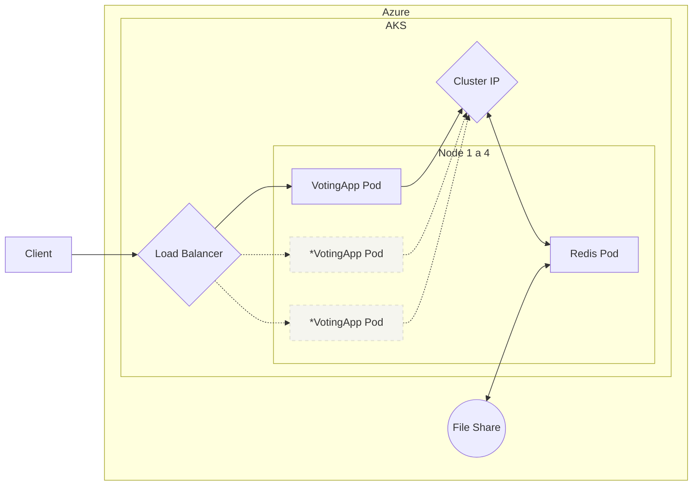

# Brief 6 - Documentation 

## Executive Summary
### Demande du client
Les utilisateurs doivent pouvoir voter sur une application web, elle doit être hautement disponible et accessible depuis un nom de domaine via le protocole `HTTPS`. Ses données doivent être persistantes.

### Solution proposée
Cette application sera déployée avec Kubernetes sur Azure. Un Ingress sera mis en place afin de pouvoir correspondre aux critères de sécurité cités plus haut. La base de données Redis, et la Voting App d'Azure seront choisis.

### État actuel
L'application fonctionne et est hautement disponible, ses données sont persistantes. En revanche la partie sécurité et l'Ingress ne sont pas encore implémentés.

## Fonctionnement de Kubernetes (aka k8s)

**Kubernetes** est un outil, développé par Google, basé sur **Docker**, permettant de déployer une infrastructure à l'aide de fichiers de configuration. Déjà implémenté dans Azure (AWS et Google Platform) il suffit de s'y connecter (avec `kubectl`) pour y déployer des ressources.

Cet outil a pour particularité de modifier l'infrastructure existante afin de la faire correspondre avec la configuration donnée. Cela a pour avantage de ne pas avoir à supprimer puis recréer des ressources déjà fonctionnelles.

### Kubectl
`kubectl` est un outil en ligne de commande (CLI) permettant la communication avec l'API de Kubernetes.

Il permet d'appliquer des manifestes, de lire les logs, ou de connaitre le status des ressources déployées.

### Manifeste
Les fichiers de configuration (manifestes) doivent être écrits en YAML afin d'être interpretables.

Les ressources déployées via un manifeste k8s s'organisent de cette manière en YAML :

```yml
---
apiVersion: # Version de l'API chargée d'interpreter cette ressource
kind: # Type de ressource
metadata: # Métadonnées et labels
spec: # Paramètres de la ressource
```

### Secrets
A l'aide de `kubectl`, il est possible de créer des secrets. Cette fonctionnalité permet de garder privé, des token, ou des identifiants que l'on souhaiterai utiliser dans un manifeste.

Les secrets doivent être créés avant d'appliquer un manifeste.

### Ressources
#### Deployment et pods
Un `Pod` est une surcouche regroupant un ou plusieurs container. Un `Deployment` permet la configuration et le déploiement d'un ou plusieurs pods (voir [documentation officielle](https://kubernetes.io/docs/concepts/workloads/controllers/deployment/) pour des exemples).

#### Réseau
Deux types de `Service` sont utilisés dans ce brief, le `ClusterIP` et le `LoadBalancer`, ils permettent tous deux l'accès à des ressources (ex : les pods contenant le service applicatif).

Kubernetes, à la manière de Docker, dispose [d'un outil de résolution de noms de domaines](https://kubernetes.io/docs/concepts/services-networking/dns-pod-service/), un DNS interne. 

> Commentaire : Fonctionnalité qui m'a été utile (afin d'indiquer une base de données redis se trouvant dans un node différent de celui de l'application)

#### Stockage
Pour disposer d'un stockage persistant, il est nécessaire de déclarer un `PersistentVolume` ainsi qu'un `PersistentVolumeClaim`. Ses resources réclameront et rendront accessible un espace de stockage créé en amont.

<!--
INTEROGATIONS :
LABELS
INGRESS
DIFFERENCE ENTRE STRATEGY dans deployment ET HorizontalPodAutoscaler
-->

## DAT (Document d’Architecture Technique) de l’infrastructure déployée

### Critères
L'infrastructure déployée doit valider un certain nombre de conditions :
- [x] Éxécuter une application de vote
- [x] Être scalable (supporter le test de charge présenté dans le brief 4)
- [x] Avoir une base de données Redis persistante
- [ ] Être accessible à travers un `Ingress`
- [ ] Être accessible en HTTPS (avec un nom de domaine)

### **Liste ressources**

-----------
| Nom | Type | Commentaire | Validé |
| :--------: | :--------: | :--------: | :--------: |
| ResourceGroup | Ressource Azure | | ✓ |
| Redis | Image | redis:latest  | ✓ |
| Voting App | Image | whujin11e/public:azure_voting_app | ✓ |
| Load Balancer | AKS | | ✓ |
| ClusterIP | AKS | | ✓ |
| Kebernetes Secret |   |   | ✓ |
| Storage Secret | Ressource Azure |   | ✓ |
| Storage Account | Ressource Azure | | ✓ |
| File Share | Ressource Azure |  Dépend du Storage Account| ✓ |
| Persistent Volume | AKS | | ✓ |
| Persistent Volume Claim | AKS | | ✓ |
| Ingress | AKS | Si présent ajouter un `ClusterIP` et supprimer le `LoadBalancer` | ✗ |
| Certificat TLS |  |   | ✗ |

### La topologie de l'infrastructure
> A noter que le script rendu ne déploie pas l'Ingress


```mermaid
flowchart LR

client[Client]-->load_balancer

subgraph Azure
    subgraph AKS
    
        subgraph node_1[Node 1 a 4]
            pod_appli_11[VotingApp Pod]
            pod_appli_12[*VotingApp Pod]:::scale_later
            pod_appli_13[*VotingApp Pod]:::scale_later
            
            pod_database_1[Redis Pod]
        end
        
        cluster_ip{Cluster IP}<-->pod_database_1
        
        load_balancer{Load Balancer}-->pod_appli_11
        load_balancer-.->pod_appli_12
        load_balancer-.->pod_appli_13

        pod_appli_11-->cluster_ip
        pod_appli_12-.->cluster_ip
        pod_appli_13-.->cluster_ip
    end

    file_storage((File Share))<--> pod_database_1
end
classDef scale_later fill:#ECECFF87,stroke:#4040401c,stroke-width:2px,stroke-dasharray: 5 5
```
\* Se crée lorsque l'application scale

## Liste des tâches et méthodologie
- [x] Création des ressources Azure nécessaires
    - Créer un nouveau Resource Group
    - Créer un Cluster AKS et un Pool contenant 4 nodes 
    - Créer un Storage Account et son File Share
- [x] Installation de `kubectl`
- [x] Rédaction d'un manifeste K8S
    - Lire la documentation
    - Rédiger le déploiement de l'infrastructure minimale (`VotingApp` + `Redis` + `Service`)
    - Ajouter des secrets pour la connexion avec la base de données et pour le File Share
    - Ajouter d'un `PersistentVolume` et d'un `PersistentVolumeClaim` afin d'exploiter le File Share créé plus tôt
- [x] Effectuer un test de charge (avec le script du brief 4)

> Commentaire : Le brief étant bien accompagné, j'ai juste eu à suivre à la lettre les instructions, une par une, en m'aidant de la documentation. En revanche, j'ai fait l'erreur de ne pas lire entièrement le brief avant de commencer. Ce qui m'a vallu de perdre du temps alors que toutes les réponses se trouvait dedans.
